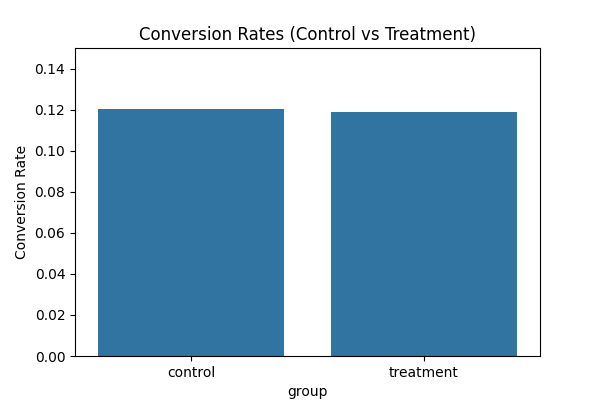

# A/B Testing Report

**Conversion Rates:**
- Control: 0.1204
- Treatment: 0.1189

**T-Test:**
- T-statistic: 1.2369
- P-value: 0.2161

**Conclusion:**  
❌ Result: Not Statistically Significant — could be random.

